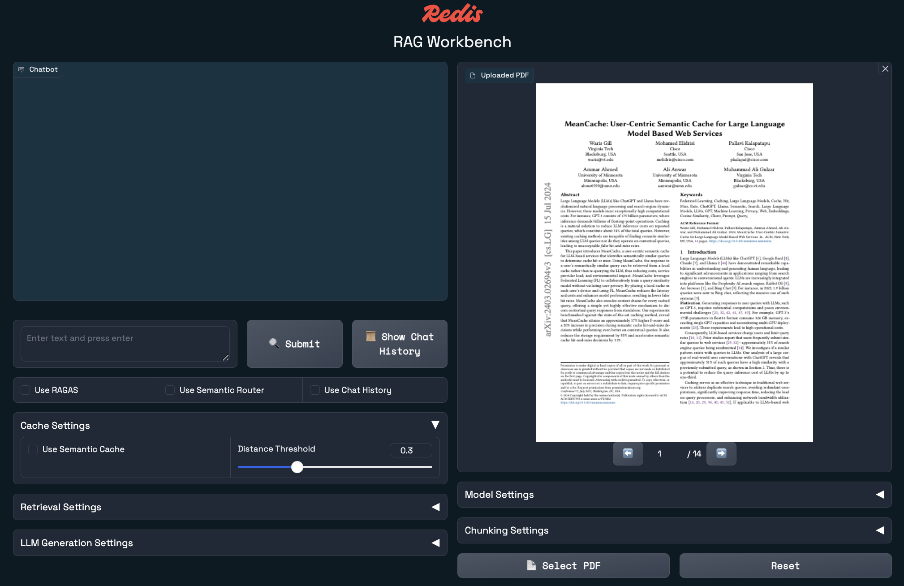

<div align="center">
<div> </div>
<h1>🚀 Redis RAG Workbench</h1>

[](https://opensource.org/licenses/MIT)


**🎯 The ultimate RAG development playground powered by Redis**

</div>

🔥 **Redis RAG Workbench** is a development environment for building and experimenting with **Retrieval-Augmented Generation (RAG)** applications. This fork is pinned to a single OpenShift AI LLM, a single OpenShift AI embedding model, and a Redis instance inside the cluster.

✨ **What makes this special?**
- 🚀 **One-command setup** - Get started in seconds with `make setup`
- ⚡ **Fixed model stack** - OpenShift AI hosted Llama and Granite models
- 🎯 **Redis-powered** - Vector search, caching, and memory management
- 🐳 **Docker ready** - Consistent development across all environments
- 🔧 **Developer-first** - Hot reload, code formatting, and quality checks built-in

---

## Table of Contents

- [Quick Start](#quick-start)
- [Prerequisites](#prerequisites)
- [Getting Started](#getting-started)
  - [Available Commands](#available-commands)
  - [Development Workflows](#development-workflows)
  - [Environment Configuration](#environment-configuration)
- [Project Structure](#project-structure)
- [Troubleshooting](#troubleshooting)
- [Contributing](#contributing)
- [License](#license)
- [Learn More](#learn-more)


## Quick Start

**Get up and running in 3 commands:**

```bash
git clone https://github.com/redis-developer/redis-rag-workbench.git
cd redis-rag-workbench
make setup && make dev
```

Then visit `http://localhost:8000` and start chatting with your PDFs! 🎉

---

## Prerequisites

1. Make sure you have the following tools available:
   - [Docker](https://www.docker.com/products/docker-desktop/)
   - [uv](https://docs.astral.sh/uv/)
   - [make](https://www.make.com/en)
2. Network access from the running app to:
   - the OpenShift AI LLM endpoint
   - the OpenShift AI embedding endpoint
   - the Redis host inside the cluster


## Getting Started

> 🌐 Access the workbench at `http://localhost:8000` in your web browser.

<div> </div>

> ⏱️ First run may take a few minutes to download model weights from Hugging Face.

### Available Commands

| Command | Description |
|---------|-------------|
| `make setup` | Initial project setup (install deps & create .env) |
| `make install` | Install/sync dependencies |
| `make dev` | Start development server with hot reload |
| `make serve` | Start production server |
| `make format` | Format and lint code |
| `make check` | Run code quality checks without fixing |
| `make docker` | Rebuild and run Docker containers |
| `make docker-up` | Start Docker services (without rebuild) |
| `make docker-logs` | View Docker application logs |
| `make docker-down` | Stop Docker services |
| `make clean` | Clean build artifacts and caches |

### Development Workflows

**Local Development:**
```bash
make setup           # One-time setup
# Edit .env if you need to override the default endpoints
make dev             # Start development server
```

**Docker Development:**
```bash
make setup           # One-time setup  
# Edit .env if you need to override the default endpoints
make docker          # Build and start containers
make docker-logs     # View logs
```

**Docker Management:**
```bash
make docker-up       # Start existing containers
make docker-down     # Stop all services
make docker-logs     # Follow application logs
```

**Code Quality:**
```bash
make format          # Auto-fix formatting issues
make check           # Check code quality without changes
```

### Environment Configuration

The project uses a single `.env` file for configuration. Copy from the example:

```bash
cp .env-example .env
```

Default variables:
- `LLM_MODEL=llama-3.2-3b-instruct`
- `LLM_ENDPOINT=https://llama-32-3b-instruct-rag.apps.mays-demo.sandbox3060.opentlc.com`
- `EMBEDDING_MODEL=granite-embedding-english-r2`
- `EMBEDDING_ENDPOINT=https://granite-embedding-english-r2-rag.apps.mays-demo.sandbox3060.opentlc.com`
- `REDIS_HOST=10.131.0.60`
- `REDIS_PORT=11739`
- `REDIS_PASSWORD=RfXEZmVr`

Optional variable:
- `OPENSHIFT_AI_API_KEY` - only needed if your OpenShift AI routes require authentication

## Project Structure

- `main.py`: The entry point of the application
- `demos/`: Contains workbench demo implementation
- `shared_components/`: Reusable utilities and components
- `static/`: Static assets for the web interface

## Contributing

🤝 Contributions are welcome! Please feel free to submit a Pull Request.

## License

This project is licensed under the MIT License - see the LICENSE file for details.

## Troubleshooting

### Apple Silicon (M1+)

If you find that `docker` will not work, it's possible you need to add the following line in the `docker/Dockerfile` (commented out in the Dockerfile for ease-of-use):

```dockerfile
RUN apt-get update && apt-get install -y build-essential
```

## Learn More

To learn more about Redis, take a look at the following resources:

- [Redis Documentation](https://redis.io/docs/latest/) - learn about Redis products, features, and commands.
- [Learn Redis](https://redis.io/learn/) - read tutorials, quick starts, and how-to guides for Redis.
- [Redis Demo Center](https://redis.io/demo-center/) - watch short, technical videos about Redis products and features.
